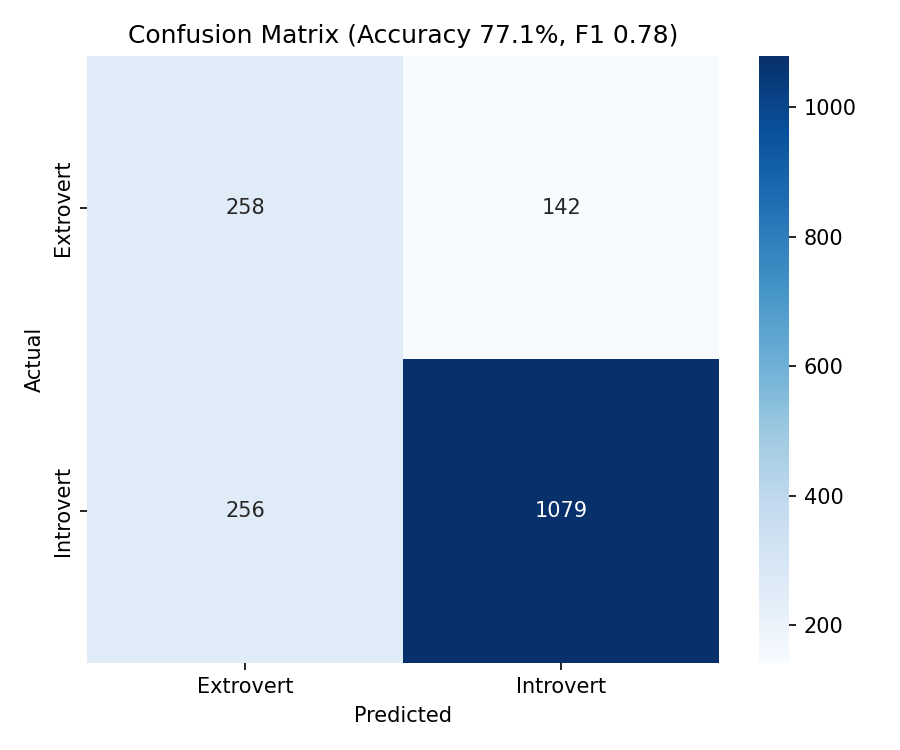

# Personality Detection — Introvert vs Extrovert
### Live Demo
https://personality-detection-bcsmog26e6uqc8t57xp3vc.streamlit.app

[Open Streamlit App](https://personality-detection-bcsmog26e6uqc8t57xp3vc.streamlit.app)
## Overview
A real-time NLP classifier that predicts personality type
(Introvert / Extrovert) from text input. Built with Python,
scikit-learn, and deployed on Streamlit Cloud.
## Results
| Metric | Score |
|-----------|--------|
| Accuracy | 77.1% |
| F1 Score | 0.78 |

## Tech Stack
- Python, pandas, scikit-learn
- TF-IDF vectorisation (5000 features, bigrams)
- Logistic Regression with class balancing
- Streamlit for web deployment
## Dataset
MBTI Personality Type Dataset —
[Kaggle](https://www.kaggle.com/datasets/datasnaek/mbti-type)
8,675 social media posts labelled with 16 MBTI personality types.
Simplified to binary: Introvert (I*) vs Extrovert (E*).
## Run Locally
```bash
git clone https://github.com/sonianaik2707/personality-detection.git
cd personality-detection
pip install -r requirements.txt
python src/train.py   # trains the model and saves model.pkl + vectorizer.pkl
streamlit run src/app.py   # launches the Streamlit web app
```
## Project Structure
```
personality-detection/
├── data/
│   └── mbti_1.csv
│
├── images/
│   ├── class_dist.png
│   └── confusion_matrix.png
│
├── models/
│   ├── model.pkl
│   └── vectorizer.pkl
│
├── notebooks/
│   └── 01_eda.ipynb
│
├── src/
│   ├── app.py
│   ├── preprocess.py
│   ├── train.py
│   └── tf_idf_vectorization.py
│
├── requirements.txt
└── README.md
```
```
